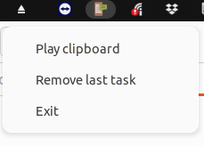

# clipboard-tts-indicator

This package provides a text-to-speech client program to interact with the server `text-to-speech-program`.



## 1. Installing

To install the package from [PyPI](https://pypi.org/project/clipboard_tts_client/), follow the instructions below:


```bash
pip install --upgrade clipboard_tts_client
```

Execute `which clipboard-tts-indicator` to see where it was installed, probably in `/home/USERNAME/.local/bin/clipboard-tts-indicator`.

### Installing and adding the program to the Linux startup session

Installing and adding a bar indicator to Linux startup session (`~/.config/autostart/clipboard-tts-indicator.desktop`)

```bash
pip install --upgrade clipboard_tts_client
clipboard_tts_client --autostart
```

### Using

To start, use the command below:

```bash
clipboard-tts-indicator
```

## 2. More information

If you want more information go to [doc](https://github.com/trucomanx-voice/ClipboardTTSClient/blob/main/doc) directory

## 3. Buy me a coffee

If you find this tool useful and would like to support its development, you can buy me a coffee!  
Your donations help keep the project running and improve future updates.  

[☕ Buy me a coffee](https://ko-fi.com/trucomanx) 

## 4. License

This project is licensed under the GPL license. See the `LICENSE` file for more details.
